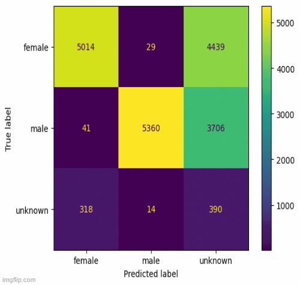

# GenderNamePredictor

Project code for predicting gender using name-based inference (gender-guesser). The data was extracted from Amsterdam City Archives for over 25,000 records
from 16th to 19th-century.

[Colab Link](https://colab.research.google.com/drive/1zW2s_7xSIjbJVucHDVck0klo0jIRn7SM?usp=sharing)

